# 标书HTML预览功能需求规格

# **1. 组件定位**

## **1.1 核心职责**

本组件负责在标书生成完成后，将标书内容渲染为精美HTML并在WebView中预览，同时保留导出Word文档的能力。

## **1.2 核心输入**

1. 用户点击"预览标书"按钮的操作指令
2. 标书文档数据（BidDocument），包含大纲、正文内容、样式配置（cover_style/layout_style/color_scheme等）
3. 后端 /preview-html API 返回的完整HTML字符串
4. 用户点击"导出标书"按钮的操作指令

## **1.3 核心输出**

1. 精美HTML预览页面（WebView渲染）
2. 导出的Word文档（通过ExportModal保存本地或分享至微信）
3. 导航路由跳转（BidWriter → BidHtmlPreview）

## **1.4 职责边界**

1. 本组件不负责HTML内容的生成逻辑（由后端 html_exporter 负责）
2. 本组件不负责Word文档的生成逻辑（由后端 BidExporter 负责）
3. 本组件不负责PDF预览（PDF方案已验证失败，不在范围内）
4. 本组件不负责标书编写流程（Step 1-3 的编写逻辑不变）

---

# **2. 领域术语**

**HTML预览**
: 指将标书内容以精美HTML格式在WebView中渲染展示，用户可浏览封面、目录、正文等全部页面。

**预览标书按钮**
: 指标书完成（Step 3，status=completed）后，替换原"导出标书"按钮位置的新主操作按钮。

**导出标书**
: 指将标书导出为Word文档（.docx），通过ExportModal提供保存本地或转存微信的能力。

**封面模板（cover_style）**
: 指标书HTML预览首页的视觉风格，取值范围为 cover1~cover6，共6种封面样式。

**版式布局（layout_style）**
: 指正文内容的排版方式，取值范围为 image（文+图）、frame（文+表）、frame-image（文+表+图）。

**色系（color_scheme）**
: 指标书HTML的整体配色方案，取值范围为 black/blue/red/green/orange/cyan/purple，共7种色系。

**暗标模式（dark_bid_mode）**
: 指标书编写时使用的暗色主题模式，影响HTML预览的整体明暗风格。

**零依赖单HTML**
: 指后端生成的HTML为完全自包含文件，所有CSS/JS内联，不依赖外部资源加载。

**CSS变量主题系统**
: 指通过CSS自定义属性（:root变量）定义配色、字号、间距等，实现一键换肤的机制。

---

# **3. 角色与边界**

## **3.1 核心角色**

- 标书用户：完成标书编写后，预览标书HTML内容并导出Word文档的移动端用户

## **3.2 外部系统**

- 后端API服务（bid_writer_service）：提供 /preview-html 端点，根据标书数据和样式配置生成完整HTML字符串
- ExportModal组件：已有的导出弹窗组件，负责Word文档的保存本地和分享至微信
- WebView运行时：React Native WebView，负责渲染HTML内容

## **3.3 交互上下文**

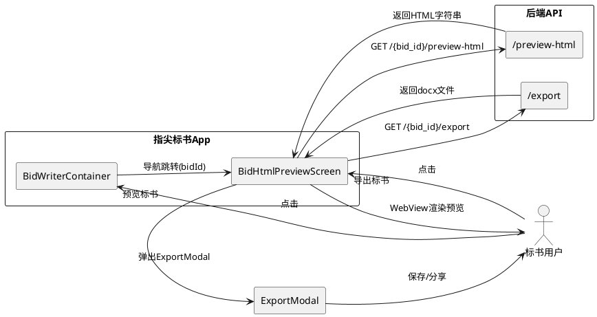

---

# **4. DFX约束**

## **4.1 性能**

1. 后端 /preview-html 端点响应时间不得超过5秒（标书内容≤10万字）
2. WebView加载并渲染HTML内容的首次可交互时间不得超过3秒
3. HTML字符串大小不得超过2MB（避免WebView内存溢出）

## **4.2 可靠性**

1. WebView渲染失败时，应显示友好的错误提示，并提供"重新加载"选项
2. 后端 /preview-html 端点异常时，前端应展示错误提示而非白屏
3. 导出功能（Word）应与现有逻辑完全一致，不得因新增预览功能而破坏导出链路

## **4.3 安全性**

1. /preview-html 端点必须要求用户认证（JWT Token）
2. 用户只能预览自己创建的标书，不得跨用户访问

## **4.4 可维护性**

1. HTML模板与业务逻辑应分离，便于后续调整封面模板和布局样式
2. CSS变量主题系统应集中管理，新增色系或封面样式时只需修改变量定义

## **4.5 兼容性**

1. HTML预览必须兼容 Android WebView（Chrome Custom Tabs 内核），不依赖WebGL、WASM等高级特性
2. 不使用外部字体CDN（Google Fonts等），所有字体使用系统字体栈，确保离线可用
3. CSS使用 clamp()、vh/vw 等现代单位，最低支持 Chrome 61+ 内核

---

# **5. 核心能力**

## **5.1 前端UI - 预览按钮替换**

### **5.1.1 业务规则**

1. **Step 3 完成状态按钮替换**：标书生成完成（status = completed）时，底部主操作按钮文字必须从"导出标书"变更为"预览标书"

   a. 验收条件：[标书status=completed且step=3] → [底部主按钮显示"预览标书"]

2. **按钮点击行为变更**：点击"预览标书"按钮时，必须导航至HTML预览页面，而非直接触发导出

   a. 验收条件：[用户点击"预览标书"按钮] → [导航至BidHtmlPreview页面，携带bidId参数]

3. **非完成状态不变**：标书尚未完成时，底部按钮逻辑不变（显示"正在编写正文..."等）

   a. 验收条件：[标书status≠completed且step=3] → [底部按钮行为与当前逻辑一致]

4. **禁止项**：不得修改Step 1和Step 2的按钮逻辑

   a. 验收条件：[step=1或step=2] → [按钮行为与修改前完全一致]

### **5.1.2 交互流程**

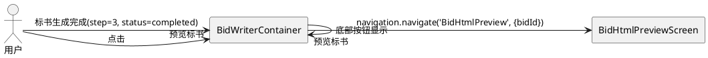

### **5.1.3 异常场景**

1. **bidId缺失**

   a. 触发条件：导航至BidHtmlPreview时bidId为空或undefined
   b. 系统行为：阻止导航，显示错误提示
   c. 用户感知：提示"标书ID无效，请返回重试"

---

## **5.2 前端UI - HTML预览页面**

### **5.2.1 业务规则**

1. **页面结构**：BidHtmlPreviewScreen必须包含顶部导航栏、WebView内容区、导出操作入口

   a. 验收条件：[进入BidHtmlPreview页面] → [页面包含返回按钮、项目名称标题、WebView区域、导出按钮]

2. **顶部导航栏**：左侧必须显示返回按钮，中间显示项目名称，右侧必须显示"导出"按钮

   a. 验收条件：[HTML预览页面加载完成] → [导航栏左有返回、中有标题、右有导出按钮]

3. **WebView渲染**：页面必须调用后端API获取HTML字符串，并通过WebView渲染

   a. 验收条件：[页面接收到HTML字符串] → [WebView加载并渲染该HTML内容]

4. **加载状态**：API请求期间，必须显示加载指示器（Loading Spinner）

   a. 验收条件：[API请求未返回] → [页面显示Loading动画]

5. **返回导航**：点击返回按钮必须回到BidWriter页面（Step 3完成状态）

   a. 验收条件：[用户点击返回按钮] → [导航回BidWriter页面，保持step=3状态]

### **5.2.2 交互流程**

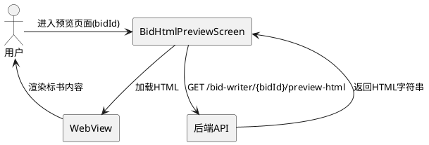

### **5.2.3 异常场景**

1. **API请求失败**

   a. 触发条件：后端 /preview-html 返回非200状态码或网络超时
   b. 系统行为：停止加载动画，显示错误页面
   c. 用户感知：显示"加载失败"提示和"重试"按钮

2. **WebView渲染错误**

   a. 触发条件：WebView onLoadEnd后检测到渲染错误
   b. 系统行为：显示错误提示，提供"重新加载"按钮
   c. 用户感知：显示"页面加载异常"提示

3. **HTML内容为空**

   a. 触发条件：API返回的HTML字符串为空或仅包含空白
   b. 系统行为：显示空状态提示
   c. 用户感知：显示"标书内容为空"提示

---

## **5.3 前端UI - 导出按钮**

### **5.3.1 业务规则**

1. **导出按钮位置**：在HTML预览页面右上角必须显示"导出"按钮

   a. 验收条件：[HTML预览页面加载完成] → [右上角显示导出按钮图标]

2. **点击导出按钮**：点击导出按钮必须触发与现有导出流程一致的Word文档导出

   a. 验收条件：[用户点击导出按钮] → [调用 /{bid_id}/export API获取docx文件，弹出ExportModal]

3. **ExportModal集成**：导出完成后必须弹出ExportModal，提供"保存本地"和"分享微信"两个选项

   a. 验收条件：[docx文件下载完成] → [弹出ExportModal，显示保存和分享选项]

4. **导出中状态**：导出过程中导出按钮必须显示加载状态且不可重复点击

   a. 验收条件：[导出API请求中] → [导出按钮显示loading，disabled状态]

### **5.3.2 交互流程**

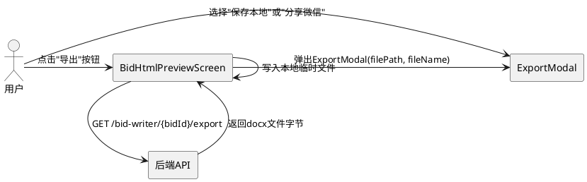

### **5.3.3 异常场景**

1. **导出API失败**

   a. 触发条件：后端 /export 返回非200状态码
   b. 系统行为：停止loading状态，显示错误提示
   c. 用户感知：提示"导出失败，请重试"

2. **文件写入失败**

   a. 触发条件：docx文件写入本地磁盘失败（存储空间不足等）
   b. 系统行为：停止导出流程，提示错误
   c. 用户感知：提示"文件保存失败，请检查存储空间"

---

## **5.4 路由导航**

### **5.4.1 业务规则**

1. **路由类型注册**：RootStackParamList中必须新增 BidHtmlPreview 路由定义

   a. 验收条件：[RootStackParamList包含 BidHtmlPreview: { bidId: string }] → [路由定义正确]

2. **路由参数**：BidHtmlPreview路由必须接收bidId参数，类型为string

   a. 验收条件：[导航至BidHtmlPreview] → [必须传递{ bidId: string }参数]

3. **导航栈管理**：从BidHtmlPreview返回时必须正确回退到BidWriter页面

   a. 验收条件：[用户在BidHtmlPreview按返回] → [回到BidWriter页面，状态保持]

### **5.4.2 交互流程**

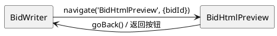

### **5.4.3 异常场景**

1. **路由参数缺失**

   a. 触发条件：导航至BidHtmlPreview时未传递bidId
   b. 系统行为：页面显示参数错误提示
   c. 用户感知：提示"参数错误，请返回重试"

---

## **5.5 后端API - HTML预览端点**

### **5.5.1 业务规则**

1. **端点定义**：必须提供 GET /bid-writer/{bid_id}/preview-html 端点

   a. 验收条件：[发送GET /bid-writer/{bid_id}/preview-html请求] → [端点可访问并返回响应]

2. **认证要求**：该端点必须要求JWT认证

   a. 验收条件：[未携带有效Token的请求] → [返回401 Unauthorized]

3. **标书状态校验**：仅当标书状态为completed时才允许预览

   a. 验收条件：[标书status≠completed] → [返回400错误，提示"标书尚未完成"]

4. **标书存在性校验**：请求的bid_id必须对应已存在的标书

   a. 验收条件：[bid_id不存在] → [返回404错误，提示"标书不存在"]

5. **响应格式**：响应必须返回完整的HTML字符串，Content-Type为text/html

   a. 验收条件：[请求成功] → [返回Content-Type: text/html，body为完整HTML文档字符串]

6. **样式参数覆盖**：端点必须支持可选的cover_style、layout_style、color_scheme、has_page_border、dark_bid_mode查询参数，用于覆盖标书文档中的默认样式设置

   a. 验收条件：[请求携带cover_style=cover3参数] → [生成的HTML使用cover3封面模板而非标书文档中的默认值]

7. **权限控制**：用户只能预览自己创建的标书

   a. 验收条件：[用户A请求预览用户B的标书] → [返回403 Forbidden]

### **5.5.2 交互流程**

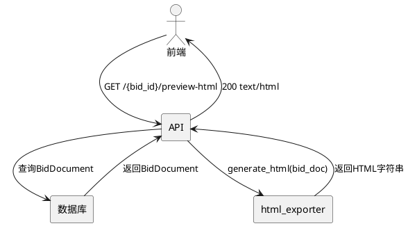

### **5.5.3 异常场景**

1. **标书内容为空**

   a. 触发条件：BidDocument的大纲（outline）为空或所有章节内容为空
   b. 系统行为：生成仅包含封面和空目录的HTML
   c. 用户感知：预览页面仅显示封面，正文区域显示"暂无内容"

2. **HTML生成过程异常**

   a. 触发条件：html_exporter生成HTML时抛出异常
   b. 系统行为：记录错误日志，返回500
   c. 用户感知：前端显示"预览生成失败"提示

---

## **5.6 HTML生成 - 整体架构**

### **5.6.1 业务规则**

1. **零依赖单HTML文件**：生成的HTML必须完全自包含，所有CSS内联于`<style>`标签，不引用外部CSS/JS文件

   a. 验收条件：[HTML字符串中] → [无`<link rel="stylesheet">`外部引用，无`<script src>`外部引用]

2. **CSS变量主题系统**：HTML必须通过`:root` CSS自定义属性定义主题变量，变量值根据color_scheme动态生成

   a. 验收条件：[color_scheme=blue] → [:root中--accent-primary等变量使用蓝色系值]

3. **语义化HTML结构**：必须使用h1-h6标题层级、table带thead/tbody、blockquote引用、section/nav等语义标签

   a. 验收条件：[HTML内容] → [章节标题使用h1-h6，表格使用table>thead+tbody，引用使用blockquote]

4. **Viewport适配**：所有字号和间距必须使用clamp()函数，确保在不同屏幕尺寸下显示良好

   a. 验收条件：[HTML中的font-size/padding/margin属性] → [使用clamp(min, preferred, max)格式]

5. **暗标模式适配**：当dark_bid_mode=true时，HTML整体使用深色背景+浅色文字配色

   a. 验收条件：[dark_bid_mode=true] → [HTML :root中--bg-primary为深色，--text-primary为浅色]

6. **页面边框**：当has_page_border=true时，HTML内容区域必须显示边框装饰

   a. 验收条件：[has_page_border=true] → [HTML内容区域有border装饰，颜色跟随color_scheme]

### **5.6.2 交互流程**

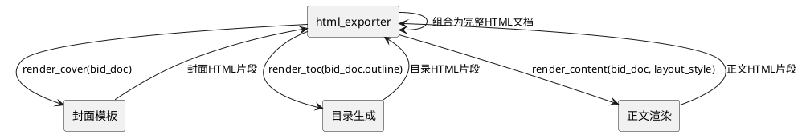

### **5.6.3 异常场景**

1. **样式配置值无效**

   a. 触发条件：cover_style不在cover1~cover6范围内，或color_scheme不在7种色系内
   b. 系统行为：使用默认值（cover_style=cover1, color_scheme=black）
   c. 用户感知：预览使用默认样式渲染，不报错

---

## **5.7 HTML生成 - 封面页**

### **5.7.1 业务规则**

1. **封面为第1页**：HTML文档的第一个页面区域必须是封面

   a. 验收条件：[HTML文档结构] → [第一个section/div为封面区域]

2. **封面必含字段**：封面必须显示项目名称（project_name）、投标单位信息、日期

   a. 验收条件：[封面HTML] → [包含project_name文本、投标单位文本、当前日期]

3. **封面样式选择**：必须根据cover_style值选择对应的封面模板（cover1~cover6）

   a. 验收条件：[cover_style=cover3] → [使用cover3对应的视觉布局和装饰元素]

4. **6种封面样式差异化**：每种封面样式必须有明显的视觉差异（布局、装饰元素、配色方案不同）

   a. 验收条件：[cover1与cover2的封面HTML] → [布局结构或装饰元素存在可区分的差异]

5. **封面色系适配**：封面装饰元素（色块、线条、图形）的颜色必须跟随color_scheme

   a. 验收条件：[color_scheme=red] → [封面装饰元素使用红色系配色]

### **5.7.2 交互流程**

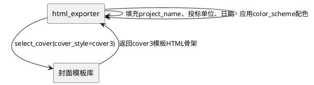

### **5.7.3 异常场景**

1. **项目名称为空**

   a. 触发条件：project_name为空字符串或undefined
   b. 系统行为：显示"未命名项目"作为占位
   c. 用户感知：封面显示"未命名项目"

---

## **5.8 HTML生成 - 目录页**

### **5.8.1 业务规则**

1. **目录为第2页**：HTML文档的第二个页面区域必须是目录

   a. 验收条件：[HTML文档结构] → [第二个section/div为目录区域]

2. **自动提取章节结构**：目录必须根据大纲（outline）的chapters结构自动生成，包含章、节、条三级

   a. 验收条件：[大纲包含3个章，每章2个节] → [目录列出3个章标题和6个节标题]

3. **目录带页码**：每个目录条目必须显示对应的页码（基于HTML内容区域的页面分隔计算）

   a. 验收条件：[目录条目] → [每个条目右侧显示页码数字]

4. **目录超链接**：每个目录条目必须是锚点链接，点击可跳转至对应章节

   a. 验收条件：[点击目录中的"第三章"条目] → [页面滚动至第三章标题位置]

5. **目录样式**：目录页必须使用缩进层级展示章→节→条三级结构

   a. 验收条件：[章标题无缩进，节标题1级缩进，条标题2级缩进] → [目录呈现层级缩进效果]

### **5.8.2 交互流程**

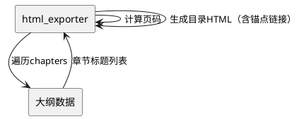

### **5.8.3 异常场景**

1. **大纲为空**

   a. 触发条件：outline为null或chapters列表为空
   b. 系统行为：生成空目录页，显示"暂无章节"
   c. 用户感知：目录页显示"暂无章节"

---

## **5.9 HTML生成 - 正文内容**

### **5.9.1 业务规则**

1. **正文从第3页起**：HTML文档的第三个页面区域起为正文内容

   a. 验收条件：[HTML文档结构] → [第三个及之后的section/div为正文区域]

2. **版式布局选择**：必须根据layout_style值选择对应的正文渲染模板

   a. 验收条件：[layout_style=image] → [使用"文+图"布局模板渲染正文]

3. **文+图模式（layout_style=image）**：文字在上、图片在下的常规论文结构布局

   a. 验收条件：[layout_style=image且有配图的章节] → [章节内容上方为文字段落，下方为图片]

4. **文+表模式（layout_style=frame）**：带边框的表格布局，表格使用边框装饰

   a. 验收条件：[layout_style=frame且有表格的章节] → [表格带边框，整体为表格布局风格]

5. **文+表+图模式（layout_style=frame-image）**：左侧文字+右侧图文网格的精美双栏布局

   a. 验收条件：[layout_style=frame-image] → [正文区域为左右双栏，左栏文字，右栏图文网格]

6. **章节标题层级**：章标题使用h1，节标题使用h2，条标题使用h3

   a. 验收条件：[章节结构为章→节→条] → [HTML中依次使用h1→h2→h3标签]

7. **表格语义化**：所有表格必须使用table>thead+tbody结构，表头在thead中

   a. 验收条件：[正文包含表格] → [HTML中table标签包含thead和tbody子元素]

8. **图片处理**：图片必须使用img标签，设置max-height约束（max-height: min(50vh, 400px)），使用object-fit: contain

   a. 验收条件：[正文包含图片] → [img标签有max-height和object-fit样式]

9. **引用块**：正文中的引用内容必须使用blockquote标签

   a. 验收条件：[正文包含引用段落] → [使用blockquote标签包裹]

### **5.9.2 交互流程**

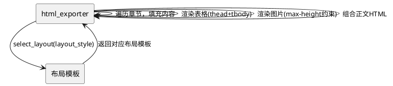

### **5.9.3 异常场景**

1. **章节内容为空**

   a. 触发条件：某章节的content为空字符串
   b. 系统行为：该章节仅显示标题，不显示内容区域
   c. 用户感知：章节标题下方无内容

2. **图片URL无效**

   a. 触发条件：图片的selected_url为空或无法访问
   b. 系统行为：跳过该图片，不渲染img标签
   c. 用户感知：图片位置不显示，不影响其他内容

3. **layout_style值无效**

   a. 触发条件：layout_style不在image/frame/frame-image范围内
   b. 系统行为：使用默认值layout_style=image
   c. 用户感知：正文使用文+图布局渲染

---

## **5.10 HTML生成 - CSS主题系统**

### **5.10.1 业务规则**

1. **CSS变量定义**：:root中必须定义以下变量类别：配色变量、字号变量、间距变量、圆角变量

   a. 验收条件：[HTML的:root块] → [包含--bg-primary, --text-primary, --accent-primary等配色变量；--title-size, --body-size等字号变量]

2. **7种色系映射**：每种color_scheme必须对应一组完整的配色变量值

   a. 验收条件：[color_scheme=blue] → [--accent-primary为蓝色系值；color_scheme=red → --accent-primary为红色系值]

3. **暗标模式色系**：dark_bid_mode=true时，--bg-primary必须为深色（#1a1a1a等），--text-primary为浅色（#ffffff等）

   a. 验收条件：[dark_bid_mode=true] → [:root中--bg-primary为深色值，--text-primary为浅色值]

4. **亮色模式色系**：dark_bid_mode=false时，--bg-primary必须为浅色（#ffffff等），--text-primary为深色（#1a1a1a等）

   a. 验收条件：[dark_bid_mode=false] → [:root中--bg-primary为浅色值，--text-primary为深色值]

5. **clamp()响应式**：所有字号和间距变量必须使用clamp(min, preferred, max)格式

   a. 验收条件：[--title-size定义] → [值为clamp(1.5rem, 4vw, 3rem)格式]

6. **页面边框变量**：has_page_border=true时，必须定义--page-border-width和--page-border-color变量

   a. 验收条件：[has_page_border=true] → [内容区域有border: var(--page-border-width) solid var(--page-border-color)]

7. **禁止外部字体**：不得使用Google Fonts或任何外部字体CDN，必须使用系统字体栈

   a. 验收条件：[HTML内容] → [font-family使用系统字体栈如"Microsoft YaHei", "PingFang SC", sans-serif]

### **5.10.2 交互流程**

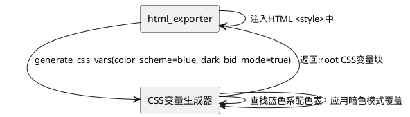

### **5.10.3 异常场景**

1. **color_scheme值无效**

   a. 触发条件：color_scheme不在7种预定义色系中
   b. 系统行为：使用默认值color_scheme=black
   c. 用户感知：HTML使用黑色系配色渲染

---

## **5.11 非功能性需求 - 离线与响应式**

### **5.11.1 业务规则**

1. **离线渲染**：HTML一旦加载至WebView，必须可在无网络状态下完整浏览（所有样式内联，图片使用已加载的缓存）

   a. 验收条件：[HTML加载完成后断开网络] → [WebView中仍可浏览全部文字内容]

2. **响应式适配**：HTML内容必须适配不同屏幕宽度（手机竖屏320px~428px）

   a. 验收条件：[在320px宽度屏幕上浏览] → [文字不溢出，布局不错位]

3. **长内容滚动**：HTML预览页面必须支持垂直滚动浏览全部标书内容

   a. 验收条件：[标书内容超过一屏] → [WebView可垂直滚动查看全部内容]

4. **图片懒加载**：正文中的图片应使用loading="lazy"属性，避免大量图片同时加载导致卡顿

   a. 验收条件：[正文包含多张图片] → [img标签包含loading="lazy"属性]

5. **prefers-reduced-motion**：CSS中必须包含prefers-reduced-motion媒体查询，减少动画对敏感用户的影响

   a. 验收条件：[系统设置减少动效] → [CSS动画和过渡效果被禁用或最小化]

### **5.11.2 交互流程**

无额外交互流程，以上规则在HTML生成时自动满足。

### **5.11.3 异常场景**

1. **大文档性能问题**

   a. 触发条件：标书内容超过10万字或图片超过50张
   b. 系统行为：后端对图片数量进行限制（最多50张），前端WebView启用缓存优化
   c. 用户感知：预览加载可能稍慢，但不超时

---

# **6. 数据约束**

## **6.1 BidHtmlPreview路由参数**

1. **bidId**：标书唯一标识，类型string，必填，不可为空字符串

## **6.2 /preview-html请求参数**

1. **bid_id**：路径参数，标书唯一标识，类型string，必填
2. **cover_style**：查询参数，封面样式，可选值cover1~cover6，可选
3. **layout_style**：查询参数，版式布局，可选值image/frame/frame-image，可选
4. **color_scheme**：查询参数，色系，可选值black/blue/red/green/orange/cyan/purple，可选
5. **has_page_border**：查询参数，是否显示页面边框，可选值true/false，可选
6. **dark_bid_mode**：查询参数，暗标模式，可选值true/false，可选

## **6.3 /preview-html响应**

1. **Content-Type**：必须为text/html; charset=utf-8
2. **Body**：完整HTML文档字符串，包含DOCTYPE声明、html/head/body完整结构

## **6.4 CSS变量约束**

1. **--bg-primary**：主背景色，HEX格式，如#ffffff或#1a1a1a
2. **--text-primary**：主文字色，HEX格式，与--bg-primary对比度不低于4.5:1（WCAG AA标准）
3. **--accent-primary**：主题强调色，HEX格式，根据color_scheme映射
4. **--title-size**：标题字号，clamp()格式，如clamp(1.5rem, 4vw, 3rem)
5. **--body-size**：正文字号，clamp()格式，如clamp(0.875rem, 2vw, 1.125rem)

## **6.5 封面样式枚举**

| 值 | 说明 |
|---|---|
| cover1 | 封面样式1 - 经典商务 |
| cover2 | 封面样式2 - 简约现代 |
| cover3 | 封面样式3 - 科技蓝调 |
| cover4 | 封面样式4 - 典雅中国 |
| cover5 | 封面样式5 - 活力橙光 |
| cover6 | 封面样式6 - 沉稳墨绿 |

## **6.6 版式布局枚举**

| 值 | 说明 |
|---|---|
| image | 文+图模式：常规论文结构，文字在上图片在下 |
| frame | 文+表模式：带边框的表格布局 |
| frame-image | 文+表+图模式：左侧文字+右侧图文网格 |

## **6.7 色系枚举**

| 值 | 说明 | accent-primary参考值 |
|---|---|---|
| black | 黑色系 | #1a1a1a |
| blue | 蓝色系 | #1F4E79 |
| red | 红色系 | #953734 |
| green | 绿色系 | #4F6228 |
| orange | 橙色系 | #E36C09 |
| cyan | 青色系 | #205867 |
| purple | 紫色系 | #5F497A |
