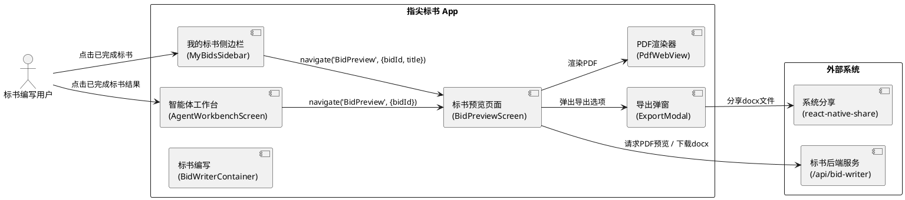
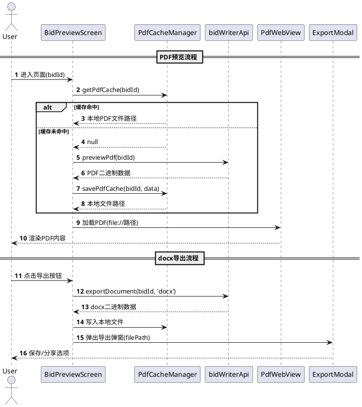

# 标书预览与导出功能 — 实现方案

# **1. 实现模型**

## **1.1 上下文视图**



## **1.2 服务/组件总体架构**

### 1.2.1 组件关系图

```plantuml
@startuml
package "Navigation Layer" {
  [RootNavigator] --> [BidPreviewScreen]
  [RootNavigator] --> [BidWriterContainer]
  [RootNavigator] --> [AgentWorkbenchScreen]
}

package "Screen Layer" {
  [BidPreviewScreen] --> [BidPreviewHeader]
  [BidPreviewScreen] --> [PdfWebView]
  [BidPreviewScreen] --> [ExportModal]
  [BidPreviewScreen] --> [BidPreviewErrorView]
}

package "Navigation Logic" {
  [MyBidsSidebar] : onSelect --> [handleSelectMyBid]
  [handleSelectMyBid] : completed/exported --> navigate('BidPreview')
  [handleSelectMyBid] : 其他状态 --> navigate('BidWriter', {step})
  [AgentWorkbenchScreen] : handleResultPress --> [BidPreviewScreen/BidWriter]
}

package "Service Layer" {
  [bidWriterApi] --> [previewPdf]
  [bidWriterApi] --> [exportDocument]
}

package "Cache Layer" {
  [PdfCacheManager] : RNFS.CachesDirectoryPath
}
@enduml
```

### 1.2.2 数据流图



## **1.3 实现设计文档**

### 1.3.1 新增文件清单

| 文件路径 | 职责 |
|---------|------|
| `src/screens/aitools/bidwriter/BidPreviewScreen.tsx` | 标书预览主页面，包含PDF预览、顶部栏、导出入口、错误状态处理 |
| `src/screens/aitools/bidwriter/components/BidPreviewHeader.tsx` | 预览页面顶部标题栏（返回按钮、标书标题、导出按钮） |
| `src/screens/aitools/bidwriter/components/PdfWebView.tsx` | PDF渲染组件，基于WebView + pdf.js实现PDF文档的缩放和滚动浏览 |
| `src/screens/aitools/bidwriter/components/BidPreviewErrorView.tsx` | 预览错误状态视图（加载失败、渲染异常等） |
| `src/screens/aitools/bidwriter/utils/pdfCacheManager.ts` | PDF缓存管理器，负责PDF文件的本地缓存读写和清理 |
| `src/assets/pdf_viewer.html` | PDF.js viewer的本地HTML资源，用于WebView加载渲染PDF |

### 1.3.2 需修改的现有文件清单

| 文件路径 | 修改内容 |
|---------|---------|
| `src/navigation/types.ts` | 在 `RootStackParamList` 中新增 `BidPreview: { bidId: string; title?: string }` 路由类型 |
| `src/navigation/RootNavigator.tsx` | 新增 `BidPreview` 路由注册，导入 `BidPreviewScreen` 组件 |
| `src/screens/aitools/bidwriter/BidWriterContainer.tsx` | 修改 `handleSelectMyBid`：对 completed/exported 状态导航到 BidPreview，其他状态保持原逻辑 |
| `src/screens/agent/AgentWorkbenchScreen.tsx` | 修改 `handleResultPress`：对 bid_writer 已完成结果导航到 BidPreview；非完成结果传递 step 参数导航到 BidWriter |
| `src/stores/useAgentTaskStore.ts` | 修改 `AGENT_TYPE_MAP` 中 bid_writer 的 navRoute 为 'BidPreview'（或保持 BidWriter 在创建时使用，导航时单独判断） |
| `src/services/bidWriter.ts` | 新增 `previewPdf` API方法，获取服务端docx转PDF后的二进制数据 |

---

# **2. 接口设计**

## **2.1 总体设计**

### 2.1.1 路由接口

**BidPreview 路由参数定义**

```typescript
// 在 RootStackParamList 中新增
BidPreview: { bidId: string; title?: string };
```

- `bidId`（必填）：标书唯一标识，从 MyBidsSidebar 或 AgentWorkbenchScreen 传入
- `title`（选填）：标书标题，用于顶部栏显示；缺失时从API `getStatus` 获取

### 2.1.2 组件接口

**BidPreviewScreen Props**

```typescript
type Props = RootStackScreenProps<'BidPreview'>;
// route.params: { bidId: string; title?: string }
```

**BidPreviewHeader Props**

```typescript
interface BidPreviewHeaderProps {
  title: string;                    // 标书标题
  onBack: () => void;              // 返回按钮回调
  onExport: () => void;            // 导出按钮回调
  exporting: boolean;              // 是否正在导出中
}
```

**PdfWebView Props**

```typescript
interface PdfWebViewProps {
  filePath: string;                 // 本地PDF文件路径（file://协议）
  onLoadStart?: () => void;        // 加载开始回调
  onLoadEnd?: () => void;          // 加载完成回调
  onError?: (error: string) => void; // 加载失败回调
}
```

**BidPreviewErrorView Props**

```typescript
interface BidPreviewErrorViewProps {
  type: 'load_failed' | 'render_failed' | 'service_unavailable' | 'timeout';
  message: string;                  // 错误提示信息
  onRetry?: () => void;            // 重试回调（load_failed/timeout时有）
  onExportDocx?: () => void;       // 导出Word回调（render_failed时有）
}
```

**PdfCacheManager 接口**

```typescript
interface PdfCacheManager {
  /** 获取PDF缓存路径，缓存不存在返回null */
  getCachePath(bidId: string): Promise<string | null>;
  /** 保存PDF数据到缓存，返回本地文件路径 */
  saveCache(bidId: string, data: ArrayBuffer): Promise<string>;
  /** 清除指定bidId的缓存 */
  clearCache(bidId: string): Promise<void>;
  /** 清除所有PDF缓存 */
  clearAllCache(): Promise<void>;
}
```

## **2.2 接口清单**

### 2.2.1 API接口

#### GET /api/bid-writer/{bidId}/preview-pdf

**描述**：获取标书PDF预览数据（服务端通过LibreOffice headless将docx转换为PDF）

**请求参数**：
| 参数 | 类型 | 位置 | 必填 | 说明 |
|------|------|------|------|------|
| bidId | string | path | 是 | 标书唯一标识 |

**响应**：
| 字段 | 类型 | 说明 |
|------|------|------|
| - | binary | PDF二进制数据流（content-type: application/pdf） |

**客户端配置**：
- `responseType: 'arraybuffer'`
- `timeout: 60000`（60秒，含服务端LibreOffice转换时间）

#### GET /api/bid-writer/{bidId}/export（已有）

**描述**：导出标书docx文件

**已有实现**：`bidWriterApi.exportDocument(bidId, 'docx', styleOptions?)`

### 2.2.2 bidWriterApi 新增方法

```typescript
// 在 bidWriterApi 对象中新增
previewPdf: (bidId: string) =>
  api.get<any, any>(`/api/bid-writer/${bidId}/preview-pdf`, {
    responseType: 'arraybuffer',
    timeout: 60000,
  }),
```

### 2.2.3 ExportModal 接口（复用现有）

现有接口无需修改：
```typescript
interface ExportModalProps {
  visible: boolean;
  onClose: () => void;
  fileName: string;
  filePath: string;   // 文件已在导出阶段写入磁盘，直接传路径
}
```

---

# **3. 组件详细设计**

## **3.1 BidPreviewScreen**

### 3.1.1 State 设计

```typescript
// 页面状态
const [loading, setLoading] = useState(true);           // PDF加载中
const [pdfFilePath, setPdfFilePath] = useState<string | null>(null); // 本地PDF文件路径
const [error, setError] = useState<{                     // 错误状态
  type: 'load_failed' | 'render_failed' | 'service_unavailable' | 'timeout';
  message: string;
} | null>(null);
const [title, setTitle] = useState<string>('');          // 标书标题
const [exporting, setExporting] = useState(false);       // 导出中
const [exportModalVisible, setExportModalVisible] = useState(false); // 导出弹窗可见
const [exportFileName, setExportFileName] = useState(''); // 导出文件名
const [exportFilePath, setExportFilePath] = useState(''); // 导出文件路径
```

### 3.1.2 核心方法

```typescript
/** 加载PDF预览数据（优先缓存） */
const loadPdfPreview = async (bidId: string): Promise<void> => {
  // 1. 检查本地缓存
  const cachedPath = await pdfCacheManager.getCachePath(bidId);
  if (cachedPath) {
    setPdfFilePath(cachedPath);
    setLoading(false);
    return;
  }
  // 2. 请求服务端
  const response = await bidWriterApi.previewPdf(bidId);
  // 3. 转为base64写入本地
  const localPath = await pdfCacheManager.saveCache(bidId, response);
  setPdfFilePath(localPath);
  setLoading(false);
};

/** 获取标书标题（route参数缺失时从API获取） */
const fetchTitle = async (bidId: string): Promise<void> => {
  if (route.params?.title) {
    setTitle(route.params.title);
    return;
  }
  const statusRes = await bidWriterApi.getStatus(bidId);
  setTitle(statusRes.title || '标书预览');
};

/** 导出docx文件 */
const handleExport = async (): Promise<void> => {
  setExporting(true);
  try {
    const response = await bidWriterApi.exportDocument(bidId, 'docx');
    // ArrayBuffer → base64 → 写入本地文件
    const base64Data = Buffer.from(new Uint8Array(response)).toString('base64');
    const fileName = sanitizeFileName(title) + '.docx';
    const filePath = `${RNFS.CachesDirectoryPath}/${fileName}`;
    await RNFS.writeFile(filePath, base64Data, 'base64');
    setExportFileName(fileName);
    setExportFilePath(filePath);
    setExportModalVisible(true);
  } catch (err) {
    Alert.alert('导出失败', err.message || '请重试');
  } finally {
    setExporting(false);
  }
};

/** 文件名清理（去除非法字符） */
const sanitizeFileName = (name: string): string => {
  return name.replace(/[\\/:*?"<>|\n\r\t]/g, '_');
};
```

### 3.1.3 生命周期

```typescript
useEffect(() => {
  if (!bidId) {
    setError({ type: 'load_failed', message: '标书信息异常' });
    return;
  }
  // 并行加载标题和PDF
  Promise.all([fetchTitle(bidId), loadPdfPreview(bidId)]).catch(handleLoadError);
}, [bidId]);
```

### 3.1.4 渲染结构

```
BidPreviewScreen
├── BidPreviewHeader        // 顶部栏（返回、标题、导出按钮）
├── loading ? Loading       // 加载态
│   : error ? BidPreviewErrorView  // 错误态
│   : PdfWebView            // PDF渲染
└── ExportModal             // 导出弹窗（复用现有）
```

## **3.2 PdfWebView（PDF预览技术方案）**

### 3.2.1 技术选型：WebView + pdf.js

**选择理由**：
1. 项目中没有 `react-native-pdf` 依赖，引入新原生库需要重新link、增加包体积
2. 项目已有 `react-native-webview`（v13.16.0），可零成本复用
3. pdf.js 是 Mozilla 维护的成熟PDF渲染库，兼容 Android 8.0+ / iOS 13.0+
4. 与 MarpSlideViewerScreen 的 WebView 渲染模式保持一致的代码结构（DFX可维护性约束）

### 3.2.2 实现方案

**方案：本地HTML + pdf.js CDN**

在 `assets/pdf_viewer.html` 中内嵌 pdf.js viewer，WebView 加载该HTML后通过 `injectJavaScript` 注入PDF文件路径。

```html
<!-- pdf_viewer.html 核心结构 -->
<!DOCTYPE html>
<html>
<head>
  <meta charset="utf-8">
  <meta name="viewport" content="width=device-width, initial-scale=1.0, maximum-scale=3.0, user-scalable=yes">
  <script src="https://cdnjs.cloudflare.com/ajax/libs/pdf.js/4.0.379/pdf.min.mjs"></script>
</head>
<body>
  <canvas id="pdf-canvas"></canvas>
  <script>
    // 由原生端注入PDF文件路径
    async function loadPdf(filePath) {
      const pdf = await pdfjsLib.getDocument(filePath).promise;
      // 逐页渲染到canvas
    }
  </script>
</body>
</html>
```

**WebView 配置**：
```typescript
<WebView
  source={Platform.OS === 'android'
    ? { uri: 'file:///android_asset/pdf_viewer.html' }
    : { uri: 'pdf_viewer.html' }}
  allowFileAccess={true}
  allowUniversalAccessFromFileURLs={true}
  originWhitelist={['*']}
  mixedContentMode="always"
  javaScriptEnabled={true}
  domStorageEnabled={true}
  scrollEnabled={true}
/>
```

**PDF加载流程**：
1. WebView 加载 `pdf_viewer.html`（onLoadEnd触发）
2. 通过 `injectJavaScript` 注入本地PDF文件路径：`loadPdf('file:///data/.../cache/bid_xxx.pdf')`
3. pdf.js 解析并渲染PDF到canvas，支持缩放和滚动

### 3.2.3 离线降级方案

若CDN不可用（离线环境），将 pdf.min.mjs 打包至 `assets/` 目录，HTML 中引用本地路径：
```html
<script src="file:///android_asset/pdf.min.mjs"></script>
```

## **3.3 BidPreviewHeader**

顶部栏设计参考 MarpSlideViewerScreen 的header样式：

```
┌──────────────────────────────────────┐
│  ←  │    标书标题    │   📤 导出    │
└──────────────────────────────────────┘
```

- 左侧：返回按钮（ChevronLeft图标，暗色圆形背景）
- 中间：标书标题（单行省略）
- 右侧：导出按钮（Upload图标 + 文字，导出中显示"导出中…"并disabled）

## **3.4 BidPreviewErrorView**

根据错误类型显示不同内容：

| 错误类型 | 图标 | 提示文案 | 操作按钮 |
|---------|------|---------|---------|
| load_failed | ❌ | 预览加载失败，请重试 | [重试] |
| render_failed | ⚠️ | 预览渲染失败，请导出Word文档查看 | [导出Word] |
| service_unavailable | 🔧 | 预览服务暂不可用，请导出Word文档查看 | [导出Word] |
| timeout | ⏱️ | 预览生成超时，请稍后重试 | [重试] |

---

# **4. 数据模型**

## **4.1 设计目标**

1. **路由参数类型安全**：BidPreview路由参数在RootStackParamList中集中定义，TypeScript编译期检查
2. **缓存数据结构明确**：PDF缓存以bidId为键，存储在RNFS.CachesDirectoryPath目录
3. **错误状态可区分**：4种错误类型（load_failed/render_failed/service_unavailable/timeout）覆盖所有异常场景

## **4.2 模型实现**

### 4.2.1 路由参数

```typescript
// src/navigation/types.ts — RootStackParamList 新增
BidPreview: { bidId: string; title?: string };
```

### 4.2.2 BidStatus 与导航目标映射

```typescript
// 在 BidWriterContainer 中新增辅助函数
const isPreviewStatus = (status: BidStatus): boolean => {
  return status === 'completed' || status === 'exported';
};

// handleSelectMyBid 修改为：
const handleSelectMyBid = useCallback((item: MyBidsListItem) => {
  closeMyBids();
  if (isPreviewStatus(item.status)) {
    navigation.navigate('BidPreview', { bidId: item.id, title: item.title });
  } else {
    const targetStep = statusToStep(item.status);
    navigation.replace('BidWriter', { bidId: item.id, step: targetStep });
  }
}, [closeMyBids, navigation, statusToStep]);
```

### 4.2.3 PDF缓存数据模型

```typescript
// src/screens/aitools/bidwriter/utils/pdfCacheManager.ts

import RNFS from 'react-native-fs';
import { Buffer } from 'buffer';

const PDF_CACHE_DIR = `${RNFS.CachesDirectoryPath}/bid_preview_pdf`;

export const pdfCacheManager = {
  /** 获取缓存路径 */
  getCachePath: async (bidId: string): Promise<string | null> => {
    const filePath = `${PDF_CACHE_DIR}/${bidId}.pdf`;
    const exists = await RNFS.exists(filePath);
    return exists ? filePath : null;
  },

  /** 保存PDF到缓存 */
  saveCache: async (bidId: string, data: ArrayBuffer): Promise<string> => {
    // 确保缓存目录存在
    const dirExists = await RNFS.exists(PDF_CACHE_DIR);
    if (!dirExists) {
      await RNFS.mkdir(PDF_CACHE_DIR);
    }
    const filePath = `${PDF_CACHE_DIR}/${bidId}.pdf`;
    const base64Data = Buffer.from(new Uint8Array(data)).toString('base64');
    await RNFS.writeFile(filePath, base64Data, 'base64');
    return filePath;
  },

  /** 清除指定缓存 */
  clearCache: async (bidId: string): Promise<void> => {
    const filePath = `${PDF_CACHE_DIR}/${bidId}.pdf`;
    const exists = await RNFS.exists(filePath);
    if (exists) await RNFS.unlink(filePath);
  },

  /** 清除所有PDF缓存 */
  clearAllCache: async (): Promise<void> => {
    const dirExists = await RNFS.exists(PDF_CACHE_DIR);
    if (dirExists) await RNFS.unlink(PDF_CACHE_DIR);
  },
};
```

### 4.2.4 缓存策略

| 策略项 | 规则 |
|--------|------|
| 缓存目录 | `RNFS.CachesDirectoryPath/bid_preview_pdf/` |
| 文件命名 | `{bidId}.pdf` |
| 缓存时机 | 首次加载PDF数据后写入缓存 |
| 缓存命中 | 二次打开同一标书时优先读取本地缓存，跳过网络请求 |
| 缓存失效 | 使用CachesDirectoryPath，系统存储不足时自动清理 |
| 主动清理 | 不设TTL，由系统管理；提供 `clearAllCache` 方法供设置页调用 |

---

# **5. 路由设计**

## **5.1 新增BidPreview路由**

### 5.1.1 types.ts 修改

在 `RootStackParamList` 中 `BidWriter` 后面新增：

```typescript
BidPreview: { bidId: string; title?: string };
```

### 5.1.2 RootNavigator.tsx 修改

```typescript
// 新增import
import BidPreviewScreen from '@/screens/aitools/bidwriter/BidPreviewScreen';

// 在 BidWriter Screen 后面新增
<Stack.Screen name="BidPreview" component={BidPreviewScreen} />
```

---

# **6. 导航逻辑修改设计**

## **6.1 BidWriterContainer — handleSelectMyBid 修改**

**现状**：所有状态统一 `navigation.replace('BidWriter', { bidId, step })`

**修改后**：
```typescript
const handleSelectMyBid = useCallback((item: MyBidsListItem) => {
  closeMyBids();
  if (item.status === 'completed' || item.status === 'exported') {
    // 已完成/已导出 → 跳转预览页面
    navigation.navigate('BidPreview', { bidId: item.id, title: item.title });
  } else {
    // 草稿/编写中 → 跳转编写页面（保持原逻辑）
    const targetStep = statusToStep(item.status);
    navigation.replace('BidWriter', { bidId: item.id, step: targetStep });
  }
}, [closeMyBids, navigation, statusToStep]);
```

**关键变化**：
- 使用 `navigation.navigate`（非replace）跳转到BidPreview，允许返回
- 传入 `title` 参数，避免预览页面额外请求标题

## **6.2 AgentWorkbenchScreen — handleResultPress 修改**

**现状**：
```typescript
if (agentType === 'bid_writer') {
  navigation.navigate(config.navRoute, { bidId: item.id });
  // Bug: 缺少 step 参数，且未区分已完成/进行中
}
```

**修改后**：
```typescript
if (agentType === 'bid_writer') {
  if (isCompleted(item.status)) {
    // 已完成 → 跳转预览页面
    navigation.navigate('BidPreview', { bidId: item.id, title: item.title });
  } else if (isWorking(item.status)) {
    // 工作中 → 提示
    overlay.toast.info('正在执行中，请稍候');
    return;
  } else if (isFailed(item.status)) {
    // 失败 → 根据状态计算step跳转到编写页面
    const step = mapBidStatusToStep(item.status);
    navigation.navigate('BidWriter', { bidId: item.id, step });
  } else {
    // 其他状态 → 跳转编写页面
    const step = mapBidStatusToStep(item.status);
    navigation.navigate('BidWriter', { bidId: item.id, step });
  }
}
```

**辅助函数**：
```typescript
const mapBidStatusToStep = (status: string): number => {
  if (['completed', 'exported', 'reviewing', 'generating', 'outline_confirmed'].includes(status)) return 3;
  if (['draft', 'parsing'].includes(status)) return 1;
  return 2;
};
```

## **6.3 AGENT_TYPE_MAP 策略**

**不修改** `AGENT_TYPE_MAP` 中 bid_writer 的 navRoute，原因：
- `navRoute: 'BidWriter'` 仍在"创建任务"场景中使用
- 导航逻辑已在 `handleResultPress` 中单独判断，不依赖 `navRoute`

---

# **7. 缓存策略设计**

## **7.1 PDF预览缓存**

| 维度 | 方案 |
|------|------|
| 存储位置 | `RNFS.CachesDirectoryPath/bid_preview_pdf/{bidId}.pdf` |
| 写入时机 | 首次从服务端获取PDF数据后 |
| 读取时机 | 每次进入BidPreviewScreen，优先检查缓存 |
| 更新策略 | 不自动更新（标书completed后内容不变） |
| 清理策略 | 使用CachesDirectoryPath，系统自动管理；提供手动清理入口 |
| 最大容量 | 单个PDF ≤ 50MB（与spec约束一致） |

## **7.2 docx导出缓存**

导出的docx文件使用临时存储，每次导出覆盖：
- Android: `RNFS.CachesDirectoryPath/{sanitized_title}.docx`
- iOS: `RNFS.CachesDirectoryPath/{sanitized_title}.docx`

---

# **8. 错误处理设计**

## **8.1 错误分类与处理**

| 错误场景 | 错误类型 | 用户提示 | 操作 | 日志 |
|---------|---------|---------|------|------|
| PDF预览网络请求失败 | load_failed | 预览加载失败，请重试 | 重试按钮 | console.error |
| PDF预览请求超时（>60s） | timeout | 预览生成超时，请稍后重试 | 重试按钮 | console.error |
| 服务端LibreOffice不可用 | service_unavailable | 预览服务暂不可用，请导出Word文档查看 | 导出Word按钮 | console.error |
| PDF数据损坏/格式错误 | render_failed | 预览渲染失败，请导出Word文档查看 | 导出Word按钮 | console.error |
| bidId缺失 | load_failed | 标书信息异常 | 自动返回上一页 | console.warn |
| 导出下载失败 | - | 导出失败，请重试 | Alert提示 | console.error |
| 导出超时（>120s） | - | 导出超时，请检查网络后重试 | Alert提示 | console.error |
| 微信未安装 | - | 系统分享面板 | 回退到系统分享 | - |
| 磁盘空间不足 | - | 存储空间不足，请清理后重试 | Alert提示 | console.error |

## **8.2 网络错误识别**

```typescript
const classifyError = (err: any): ErrorType => {
  const msg = String(err?.message || '').toLowerCase();
  if (msg.includes('timeout') || msg.includes('econnaborted')) return 'timeout';
  if (msg.includes('503') || msg.includes('service unavailable')) return 'service_unavailable';
  return 'load_failed';
};
```

---

# **9. Bug修复方案（AgentWorkbenchScreen step参数）**

## **9.1 问题描述**

`AgentWorkbenchScreen.handleResultPress` 中处理 bid_writer 类型结果时：
1. **缺少 step 参数**：`navigation.navigate(config.navRoute, { bidId: item.id })` 未传递 step
2. **未区分已完成/进行中状态**：所有状态统一导航到 BidWriter，已完成标书应导航到 BidPreview

## **9.2 修复方案**

在 `handleResultPress` 方法中对 `bid_writer` 类型做特殊处理（见第6.2节）：

1. 已完成（completed/exported）→ `navigation.navigate('BidPreview', { bidId, title })`
2. 工作中 → toast提示"正在执行中"
3. 失败 → toast提示"该任务已失败"
4. 其他状态 → `navigation.navigate('BidWriter', { bidId, step: mapBidStatusToStep(status) })`

## **9.3 验收条件**

- [x] 点击已完成标书结果 → 导航到 BidPreviewScreen
- [x] 点击草稿标书结果 → 导航到 BidWriter 并传入正确的 step
- [x] 点击工作中标书结果 → 显示"正在执行中"提示
- [x] 点击失败标书结果 → 显示"该任务已失败"提示

---

# **10. 文件命名规则**

导出的docx文件名遵循以下规则：

```typescript
const sanitizeFileName = (title: string): string => {
  return title.replace(/[\\/:*?"<>|\n\r\t]/g, '_');
};
// 示例："XX市政道路改造项目" → "XX市政道路改造项目.docx"
// 示例："A/B:C" → "A_B_C.docx"
```
