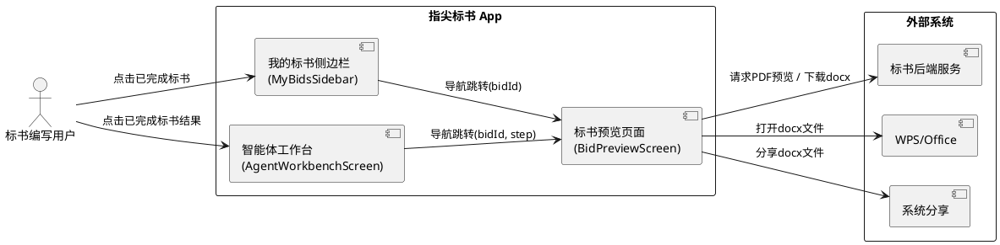
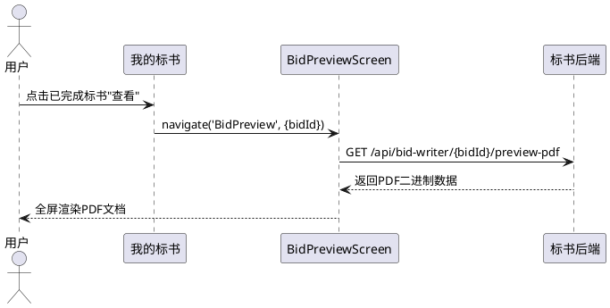
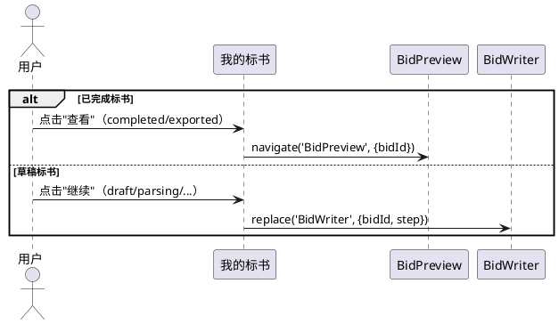
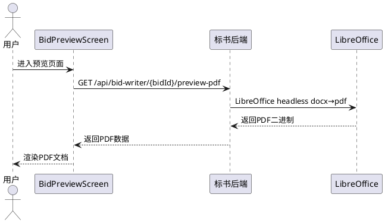
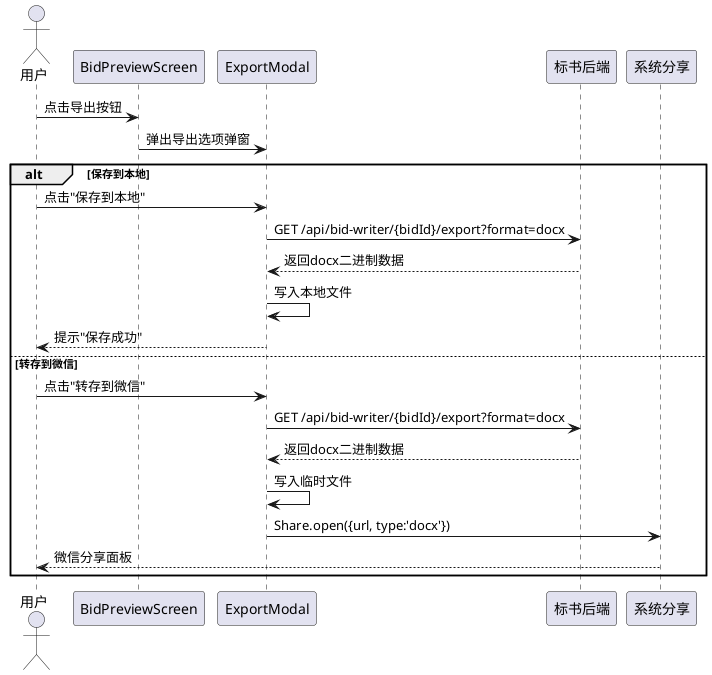
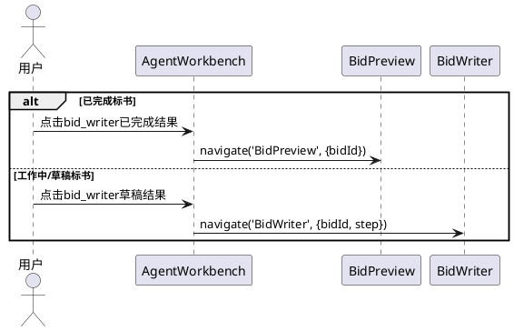

# 标书预览与导出功能需求规格

# **1. 组件定位**

## **1.1 核心职责**

本组件负责对已完成的标书文档进行PDF预览和docx导出，实现从"编写态"到"阅读态"的体验切换。

## **1.2 核心输入**

1. 标书ID（bidId）：来自"我的标书"侧边栏或AgentWorkbenchScreen的已完成标书点击事件
2. 预览请求：服务端docx转PDF后的PDF二进制数据流
3. 导出请求：服务端原始docx文件二进制数据流
4. 导出选项：用户选择的导出方式（保存到本地 / 分享到微信 / 系统分享）

## **1.3 核心输出**

1. PDF预览界面：在App内全屏展示标书PDF内容
2. 导出文件：下载到本地文件系统的docx文件
3. 分享操作：通过系统分享或微信分享发出的docx文件
4. 导航跳转：从"我的标书"已完成项跳转到预览页面（而非Step3编写页面）

## **1.4 职责边界**

1. 不负责标书的编写、编辑和生成流程（属于BidWriter Step1-3）
2. 不负责标书状态管理（completed/exported等状态判断由调用方负责）
3. 不负责docx到PDF的转换过程（由服务端LibreOffice headless完成）
4. 不负责标书元数据和列表的获取（由MyBidsSidebar和API服务负责）

---

# **2. 领域术语**

**标书预览页面（BidPreviewScreen）**
: 一个独立的App页面，用于以PDF格式全屏展示已完成标书的内容，并提供导出操作入口。

**已完成标书**
: 状态为 `completed` 或 `exported` 的标书文档，其正文内容已全部生成完毕。

**PDF预览保真度**
: App内PDF预览渲染效果与导出的Word文档在格式、排版、字体、页边距、图表等方面的一致程度。

**docx导出**
: 将服务端生成的原始Word文档（.docx格式）下载到用户设备，供WPS或微软Office打开编辑。

**statusToStep 映射**
: 将标书状态（BidStatus）映射为当前步骤（BidWriterStep）的逻辑函数，决定点击"我的标书"条目后的目标页面。

---

# **3. 角色与边界**

## **3.1 核心角色**

- **标书编写用户**：通过"我的标书"侧边栏或智能体工作台查看已完成标书，进行预览和导出操作

## **3.2 外部系统**

- **标书后端服务（/api/bid-writer）**：提供docx转PDF预览接口和docx文件下载接口
- **WPS / 微软Office**：用户设备上打开导出docx文件的应用
- **系统分享服务（react-native-share）**：将docx文件通过系统分享面板或微信分享

## **3.3 交互上下文**

---

# **4. DFX约束**

## **4.1 性能**

1. PDF预览首屏加载时间必须 ≤ 3秒（不含网络传输时间）
2. docx导出下载操作必须在网络正常情况下 ≤ 30秒完成（文件大小 ≤ 50MB）
3. PDF预览页面滚动帧率必须 ≥ 30fps

## **4.2 可靠性**

1. PDF预览加载失败时必须显示明确的错误提示和重试按钮
2. docx导出失败时必须提供降级方案（如HTML导出或重试提示）
3. 网络中断时预览页面不得崩溃，必须显示网络异常提示

## **4.3 安全性**

1. 标书文档下载URL必须经过后端鉴权验证，禁止未授权访问
2. 本地缓存的docx文件必须存储在应用私有目录，禁止其他应用直接读取

## **4.4 可维护性**

1. 预览组件必须与桩基对比报告（MarpSlideViewerScreen）的导出模式保持一致的代码结构
2. 新增的BidPreview路由必须在RootStackParamList中集中管理

## **4.5 兼容性**

1. 导出的docx文件必须兼容 WPS Office（Android/iOS）和 Microsoft Office（Android/iOS）
2. PDF预览必须兼容 Android 8.0+ 和 iOS 13.0+ 系统
3. 系统分享功能在未安装微信时必须隐藏"转存到微信"选项

---

# **5. 核心能力**

## **5.1 标书预览页面展示**

### **5.1.1 业务规则**

1. **预览页面独立性**：标书预览页面必须作为独立路由页面（BidPreview）注册在导航系统中，与BidWriter编写页面解耦
   - 验收条件：[用户在"我的标书"中点击已完成标书] → [导航到BidPreviewScreen而非BidWriter Step3]

2. **预览数据加载**：预览页面必须通过bidId向服务端请求PDF预览数据
   - 验收条件：[预览页面接收bidId参数并挂载] → [自动发起PDF预览数据请求，显示加载状态]

3. **PDF预览渲染**：预览页面必须以PDF格式全屏渲染标书文档内容
   - 验收条件：[PDF数据加载完成] → [App内全屏展示PDF文档，支持缩放和滚动浏览]

4. **预览页面顶部栏**：预览页面必须显示顶部标题栏，包含返回按钮、标书标题、导出按钮
   - 验收条件：[预览页面渲染完成] → [顶部栏左侧显示返回箭头，中间显示标书标题，右侧显示导出按钮]

5. **标书标题显示**：预览页面顶部栏必须显示该标书的项目名称
   - 验收条件：[预览页面加载完成] → [顶部栏标题与该标书的project_name一致]

6. **禁止项**：预览页面禁止显示标书编写流程的步骤条和底部操作栏
   - 验收条件：[用户进入预览页面] → [页面不显示BidWriterHeader步骤条和BidWriterFooter操作栏]

### **5.1.2 交互流程**

### **5.1.3 异常场景**

1. **PDF预览数据加载失败**
   - 触发条件：服务端PDF转换失败或网络异常
   - 系统行为：停止加载动画，展示错误提示信息和重试按钮
   - 用户感知：显示"预览加载失败，请重试"提示及重试按钮

2. **标书尚未完成时进入预览**
   - 触发条件：标书状态不为completed/exported时尝试访问预览页面
   - 系统行为：重定向到对应的编写步骤页面
   - 用户感知：自动跳转到标书编写对应步骤，不显示预览页面

3. **PDF渲染异常**
   - 触发条件：PDF数据损坏或格式不支持导致渲染失败
   - 系统行为：显示降级提示，建议用户导出docx文件后使用WPS/Office查看
   - 用户感知：显示"预览渲染失败，请导出Word文档查看"提示

---

## **5.2 导航逻辑变更**

### **5.2.1 业务规则**

1. **已完成标书导航跳转**：当用户点击"我的标书"中状态为completed或exported的标书时，必须跳转到BidPreview预览页面
   - 验收条件：[用户在MyBidsSidebar中点击状态为completed/exported的标书条目] → [导航到BidPreviewScreen并传入bidId]

2. **草稿标书导航不变**：当用户点击"我的标书"中非完成状态的标书时，必须保持原有跳转逻辑（进入BidWriter对应步骤）
   - 验收条件：[用户在MyBidsSidebar中点击状态为draft/parsing/generating_outline等非完成状态的标书] → [导航到BidWriter对应步骤页面]

3. **statusToStep映射修改**：statusToStep函数不再将completed/exported状态映射为step=3，而是由调用方直接判断并导航到预览页面
   - 验收条件：[handleSelectMyBid接收到completed/exported状态的标书] → [调用navigation.navigate('BidPreview', {bidId})而非navigation.replace('BidWriter', {bidId, step:3})]

4. **AgentWorkbenchScreen已完成标书导航**：AgentWorkbenchScreen中点击已完成的标书结果时，必须跳转到BidPreview预览页面并传入step参数
   - 验收条件：[用户在AgentWorkbenchScreen中点击bid_writer类型的已完成任务] → [导航到BidPreviewScreen并传入bidId]

5. **AgentWorkbenchScreen草稿标书导航**：AgentWorkbenchScreen中点击未完成的标书结果时，必须跳转到BidWriter对应步骤页面
   - 验收条件：[用户在AgentWorkbenchScreen中点击bid_writer类型的工作中任务] → [导航到BidWriter对应步骤页面并传入bidId和step]

### **5.2.2 交互流程**

### **5.2.3 异常场景**

1. **bidId缺失**
   - 触发条件：导航参数中bidId为空或undefined
   - 系统行为：显示错误提示并返回上一页
   - 用户感知：显示"标书信息异常"提示并自动返回

---

## **5.3 PDF预览技术方案**

### **5.3.1 业务规则**

1. **服务端docx转PDF**：PDF预览数据必须由服务端通过LibreOffice headless将docx转换为PDF后返回，保证预览与导出格式一致
   - 验收条件：[App请求标书PDF预览] → [服务端使用LibreOffice headless将对应docx转为PDF后返回二进制数据]

2. **预览保真度要求**：PDF预览渲染效果必须与导出的Word文档在排版、字体、页边距、图表、页眉页脚等方面保持一致
   - 验收条件：[同一标书的PDF预览内容与导出的docx用WPS打开后的内容] → [格式、排版、字体、图表位置一致]

3. **PDF预览交互**：预览页面必须支持PDF文档的缩放和滚动浏览
   - 验收条件：[用户在PDF预览中执行双指缩放或上下滑动] → [文档相应缩放或滚动]

4. **PDF缓存策略**：已加载的PDF预览数据必须缓存在本地，避免重复请求
   - 验收条件：[用户第二次打开同一标书的预览] → [优先使用本地缓存，无缓存时再请求服务端]

### **5.3.2 交互流程**

### **5.3.3 异常场景**

1. **服务端LibreOffice转换超时**
   - 触发条件：docx文件过大或服务端资源不足，转换超过30秒
   - 系统行为：返回超时错误，App显示重试提示
   - 用户感知：显示"预览生成超时，请稍后重试"提示

2. **服务端LibreOffice不可用**
   - 触发条件：LibreOffice服务未启动或崩溃
   - 系统行为：返回服务不可用错误
   - 用户感知：显示"预览服务暂不可用，请导出Word文档查看"提示

---

## **5.4 docx文件导出**

### **5.4.1 业务规则**

1. **导出文件格式**：导出操作必须下载服务端生成的原始docx文件，而非PDF文件
   - 验收条件：[用户点击导出按钮] → [下载的文件为.docx格式]

2. **导出操作入口**：预览页面顶部栏右侧的导出按钮点击后必须弹出导出选项弹窗
   - 验收条件：[用户在预览页面点击导出按钮] → [弹出导出选项弹窗，包含"保存到本地"和"转存到微信"选项]

3. **保存到本地**：导出弹窗中"保存到本地"选项必须将docx文件下载到设备本地存储
   - 验收条件：[用户点击"保存到本地"] → [docx文件下载到应用私有目录，提示保存成功]

4. **转存到微信**：导出弹窗中"转存到微信"选项必须通过系统分享将docx文件发送到微信
   - 验收条件：[用户点击"转存到微信"] → [调起微信分享面板，以docx文件格式分享]

5. **导出加载状态**：导出过程中导出按钮必须显示加载状态并禁止重复点击
   - 验收条件：[docx文件下载中] → [导出按钮显示"导出中..."且不可点击]

6. **文件命名规则**：导出的docx文件名必须为标书标题（去除非法字符）加.docx后缀
   - 验收条件：[标书标题为"XX市政道路改造项目"] → [导出文件名为"XX市政道路改造项目.docx"]

7. **WPS/Office兼容性**：导出的docx文件必须能被WPS Office和Microsoft Office正常打开和编辑
   - 验收条件：[导出的docx文件] → [WPS Office和Microsoft Office均能打开且排版正确]

### **5.4.2 交互流程**

### **5.4.3 异常场景**

1. **导出下载失败**
   - 触发条件：网络中断或服务端导出接口异常
   - 系统行为：停止导出，关闭加载状态，显示错误提示
   - 用户感知：显示"导出失败，请重试"提示

2. **导出超时**
   - 触发条件：docx文件过大，下载超过120秒
   - 系统行为：终止请求，恢复按钮状态
   - 用户感知：显示"导出超时，请检查网络后重试"提示

3. **微信未安装**
   - 触发条件：用户点击"转存到微信"但设备未安装微信
   - 系统行为：回退到系统分享面板
   - 用户感知：显示系统分享面板而非微信分享面板

4. **磁盘空间不足**
   - 触发条件：设备存储空间不足无法写入文件
   - 系统行为：提示磁盘空间不足
   - 用户感知：显示"存储空间不足，请清理后重试"提示

---

## **5.5 AgentWorkbenchScreen step参数Bug修复**

### **5.5.1 业务规则**

1. **step参数传递**：AgentWorkbenchScreen中点击bid_writer类型的标书结果时，必须根据标书状态计算并传递step参数
   - 验收条件：[AgentWorkbenchScreen中handleResultPress处理bid_writer已完成结果] → [导航参数中包含正确的bidId]

2. **已完成结果导航到预览**：AgentWorkbenchScreen中点击bid_writer已完成的标书时，必须导航到BidPreview预览页面
   - 验收条件：[AgentWorkbenchScreen中点击bid_writer类型且状态为completed的结果] → [导航到BidPreviewScreen并传入bidId]

3. **非完成结果导航到编写**：AgentWorkbenchScreen中点击bid_writer非完成的标书时，必须导航到BidWriter对应步骤页面并传入step参数
   - 验收条件：[AgentWorkbenchScreen中点击bid_writer类型且状态为draft的结果] → [导航到BidWriterScreen并传入bidId和step=1]

### **5.5.2 交互流程**

### **5.5.3 异常场景**

1. **AGENT_TYPE_MAP配置缺失**
   - 触发条件：bid_writer类型在AGENT_TYPE_MAP中未配置navRoute
   - 系统行为：不执行导航，显示提示
   - 用户感知：显示"功能暂不可用"提示

---

# **6. 数据约束**

## **6.1 BidPreview路由参数**

1. **bidId**：标书唯一标识，类型为string，必填
2. **title**：标书标题，类型为string，选填（用于顶部栏显示，缺失时从API获取）

## **6.2 标书状态（BidStatus）与导航目标映射**

| BidStatus | 导航目标 | 传入参数 |
|-----------|---------|---------|
| completed | BidPreview | { bidId } |
| exported | BidPreview | { bidId } |
| reviewing | BidWriter | { bidId, step: 3 } |
| generating | BidWriter | { bidId, step: 3 } |
| outline_confirmed | BidWriter | { bidId, step: 3 } |
| generating_outline | BidWriter | { bidId, step: 2 } |
| outline_editing | BidWriter | { bidId, step: 2 } |
| parsed | BidWriter | { bidId, step: 2 } |
| parsing | BidWriter | { bidId, step: 1 } |
| draft | BidWriter | { bidId, step: 1 } |

## **6.3 PDF预览API响应**

1. **content-type**：必须为 `application/pdf`
2. **响应体**：PDF二进制数据流
3. **超时时间**：客户端请求超时必须设为60秒

## **6.4 docx导出API响应**

1. **content-type**：必须为 `application/vnd.openxmlformats-officedocument.wordprocessingml.document`
2. **响应体**：docx二进制数据流
3. **超时时间**：客户端请求超时必须设为120秒
4. **文件名**：由 `Content-Disposition` 头或客户端根据标书标题生成

## **6.5 导出文件本地存储路径**

1. **Android路径**：`RNFS.CachesDirectoryPath/{sanitized_title}.docx`
2. **iOS路径**：`RNFS.CachesDirectoryPath/{sanitized_title}.docx`
3. **文件名清理**：标题中 `\\/:*?"<>|\n\r\t` 字符必须替换为下划线
